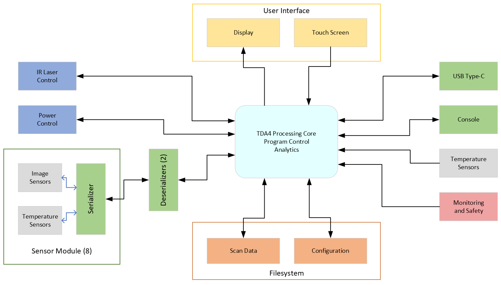
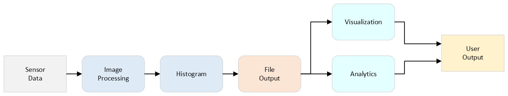

# Openwater Blood Flow Analysis Device - Software Architecture Overview

## Purpose
This document provides an overview of the software architecture for the Openwater Blood Flow Analysis device, focusing on its key components and interactions.

## Architecture Design
The software architecture follows a layered approach:

- **Presentation Layer**: User interface for interaction with the device.
- **Business Logic Layer**: Core functionality including data processing and analysis.
- **Data Access Layer**: Manages data storage and retrieval.

## Main Components
- **User Interaction Module**: Handles user inputs and displays results.
- **Data Management Module**: Responsible for data storage and management.
- **Processing & Analysis Module**: Processes blood flow data and generates analysis.
- **Device Control Module**: Manages device operations and settings.
- **Safety & Alert Module**: Ensures device safety and alerts users of any issues.

## Diagrams

High Level Software Component Diagram

High Level Data Flow Diagram

## Use Cases
- Initiating blood flow analysis.
- Viewing analysis results.
- Adjusting device settings.
- Responding to safety alerts.
- Exporting data for external review.

## Constraints
- Hardware limitations.
- Regulatory compliance.

## Goals
- Reliability, usability, safety, scalability, interoperability, maintainability, security, and performance.

---

*Note: Diagrams mentioned are located in the 'docs' folder of the project repository.*
