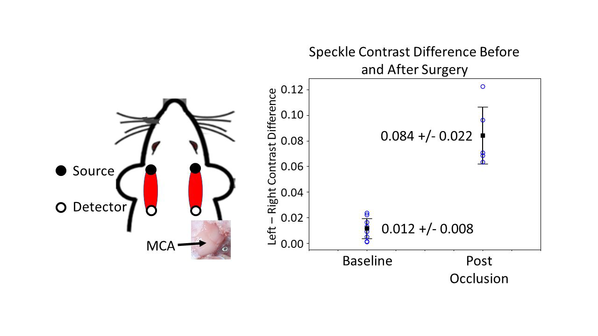

# Openwater Stroke Diagnosis Technology White Paper

## Background (defining stroke and problem statement)

According to the World Health Organization, every year 15 million people suffer a stroke, 5 million of whom die, and another 5 million of which are disabled [1]. Due to the rapid loss of brain tissue during stroke, prompt diagnosis and treatment is critical for improving stroke outcomes [2]. At Openwater we are developing the fundamental technology to produce low-cost, portable medical imaging devices capable of both functional and structural imaging. Our first prototype measures tissue hemodynamics using near-infrared light. In particular, it is designed to measure differences in blood flow with the goal of reducing the time to diagnosis of ischemic stroke. The pages below give a general overview of the technology, a description of the prototype that we have deployed, and show some of our initial results.

## Technology Overview

### Near-infrared window

Biomedical optics is a rapidly expanding field which is providing biologists and clinicians new ways to detect, diagnose, and study disease. However, most optical techniques can only be used to gain information near the tissue surface [3]. For example, confocal microscopy is only capable of imaging up to 50 μm below the tissue surface, and even optical coherence tomography only images at depth of up to 2-3 mm in opaque tissues.

The two principal obstacles to looking deep into tissue with visible light are the high degree of light absorption and scattering by tissue. There exists however, a spectral region in the near infrared (NIR) where the absorption of light by tissue is relatively low. As can be seen in Figure 1, the absorption of light by oxy- and deoxy-hemoglobin drops dramatically at around 600 nm. Likewise, the absorption of light by water is very low through wavelengths up to around 900 nm. As a result, there is a window in the NIR from about 650-950 nm where light can penetrate more deeply into tissue, and much work has been done using NIR light with the techniques mentioned above in order to maximize their penetration depth. However, the second obstacle, the high degree of light scattering, limits the use of any of the above techniques to a few millimeters [4]. The mean free path (the average distance a photon will travel before interacting with matter) of visible light in tissue is only about 100 μm, and multiple scattering events will cause the direction of the average photon to be randomized after about 1 mm. Thus, techniques which rely on ballistic or quasi-ballistic light (aka time-of-flight) are inherently limited in depth.

  
   
  

    <em>Figure 1: Near-infrared absorption spectrum of light absorbing chromophores in tissue demonstrating the spectral window from 650 - 950 nm where light can penetrate to depths of many centimeters. (Adapted from [5])</em>
  

The problem is not that NIR light cannot penetrate deeply into tissue. It does. For example, NIR light transmitted through 10 cm of human breast tissue can be detected [6]. The problem is that beyond a few millimeters deep, almost all of the remaining photons have been scattered multiple times, and their directions are random. For example, Figure 2 is a cell phone photograph of the author with an LED in his mouth. The light exiting the tissue is easily detected even though the LED itself is not visible due to the light scattering. In order to acquire information about tissues deep below the surface, a method is needed which permits this information to be extracted from detected photons which have been scattered many times. Techniques using scattered near-infrared light to interrogate deep tissues are often referred to as Diffuse Optics and/or Near-Infrared Spectroscopy (NIRS).

  
   
  

    <em>Figure 1: Near-infrared absorption spectrum of light absorbing chromophores in tissue demonstrating the spectral window from 650 - 950 nm where light can penetrate to depths of many centimeters. (Adapted from [5])</em>
  

### Diffusion approximation

The key observation underlying diffuse optical methods is that the paths of NIR photons in tissue can be described as a random walk with a step length equal to the distance over which their directions become randomized [7]. As mentioned above, this distance is about 1 mm in human tissue. As a result, if experiments are performed over distances much greater than the step length, the propagation of the NIR photons can be modeled as a diffusive process. Figure 3 is a schematic describing this process. It depicts light from an optical fiber being injected into tissue. The light intensity decreases with distance from the position of the light source. A set of detector fibers collects light exiting the tissue at various points. Using an accurate model of how the light propagates, it is possible to use the detected light to gain information about the tissue
through which it has passed, including the concentration of absorbing chromophores such as oxy- and deoxy-hemoglobin, the amount of light scattering, and the concentration and lifetime of exogenous fluorophores.

  
   
  

    <em>Figure 3: Schematic of the diffusion of light through tissue. The photons scatter randomly and spread out causing the light intensity to decrease with distance from the source. This process is well described using mathematical models of diffusion. Some of the remitted light is collected by optical fibers and is used to determine the optical properties of the tissue.</em>
  

### Lasers, Speckle, and Blood Flow

When laser light is reflected from a rough surface and then detected (e.g. by your retina or a camera) the resulting image contains randomly located light and dark spots commonly referred to as speckle [8]. The light and dark spots are due to the constructive and destructive interference between light waves that travel different distances. This phenomenon can be readily observed by shining a laser pointer at a wall and observing the reflected light (see Figure 4). It also occurs when laser light passes through highly scattering media, such as biological tissue.

If the light scattering particles which compose the scattering media are in motion, the locations of constructive and destructive interference of the light waves (i.e. the speckle) change in time. If the change from bright to dark occurs on a time scale equal to or shorter to the exposure time of the light detector, the contrast of the speckle (i.e. the difference between bright and dark spots) decreases. As a result, the contrast of the speckle pattern is related to the motion of the interfaces scattering the light. More motion, due to either the scatterers moving faster, or more of the scatterers moving, results in a decrease in speckle contrast [9].

Openwater’s blood flow technology combines diffuse optics with measurements of laser speckles. Short pulses of monochromatic laser light are injected into tissue using a fiber optic. The light diffuses through the tissue. Some of the light remitted from the tissue is collected by fiber optics located at various locations. The contrast of the measured speckles is related to the number of moving red blood cells and their speed. A measure of microvascular blood perfusion is then calculated using an algorithm based on a mathematical model of the relationship between scatterer motion and laser speckles.

  
   
  

    <em>Figure 4: Photography of laser speckles from green laser light.</em>
  

## Prototype

Our initial prototype, consists of a cart and a wand.  A schematic is shown in Figure 5. The cart houses the laser, light detectors, computer,
and various other optical and electronic components. A cord exiting from the side of the cart carries laser light to a wand. When the wand is pressed up against the patient and its acquisition button is pressed, a safe amount of near-infrared light is emitted and passes into the patient. Remitted light which carries information about the microvascular perfusion in the brain is collected by the wand’s detection fibers and transmitted to the detectors in the cart.

For each subject, we plan to measure 12 locations (6 on each side of the head) with the wand. We expect each measurement to take approximately 7 seconds with an approximately equal amount of time required to move and reposition the wand between measurements. Thus a typical exam would take approximately 3 minutes.

  
   
  

    <em>Figure 5: Schematic of the initial prototype. It consists of (A) a cart containing a laser, light detectors, computer, among other optical and electronic components, and (B) a wand which is connected to the cart by a cord. (C) Photograph of the wand. The next generation will be more compact, with the cart replaced by a small box which can be used in an ambulance.</em>
  

## Initial Results

### Gas challenges

Our initial small animal in vivo measurements were designed to detect global changes in hemodynamics caused by the inhalation of varying gas mixtures. Anesthetized rats (0.5 L/min air flow with 2% isoflurane) were given hypercapnic and hypoxic gas challenges. The hypercapnic challenge consisted of increasing the CO 2 in the gas mixture from 0% to 5% for 30 seconds. During the hypoxic challenge, the O 2 in the inhaled mixture was reduced from 20% to 10% for a period of 30 seconds. Typical results are shown in Figure 6. The left column of graphs shows the results for optical attenuation (Figure 6B) and blood flow (Figure 6C) of a hypercapnic challenge. Dilation of blood vessels due to the inhalation of excess levels of CO 2 results in increases in both optical attenuation (less light is detected) and blood flow. The right column shows the results of a hypoxic challenge. As the rat is deprived of oxygen, a decrease in hemoglobin concentration leads to a decrease in optical attenuation (more light is detected) [10] as shown in Figure 6D. No overall change in blood flow is observed (Figure 6E). In all the graphs the blue lines represent the raw time curves which are then smoothed to produce the orange curves. The oscillations in the raw blood flow curves are due to the pulse of the rat,
which is easily measured.

  
   
  

    <em>Figure 6: Results from the gas challenges of a rat. (A) Picture of a rat showing a small wand pressed up against its head. Light travels to and from the wand via the optical fibers shown. (B-C) Results of the hypercapnic challenge which causes the dilation of blood vessels. (B) Light attenuation increases (due to increased blood volume) during the challenge. (C) Blood flow also increases. (D-E) Results of the hypoxic challenge. (D) Decreased oxygenation of hemoglobin results in a decrease in optical attenuation. (E) No change in the rate of blood flow is observed during the hypoxic challenge.</em>
  

### Temporary MCA occlusion

We monitored rats during temporary occlusions of their middle cerebral artery (MCA). For each rat, a small hole was bored in the rear portion of the right side of the skull exposing MCA. Once MCA was exposed, we began monitoring blood flow by injecting light into the front right of the head, and detecting the remitted light with three detectors located at the right rear, middle, and left front of the head. After two minutes of data collection, we used a microvascular clip to occlude MCA. The clip remained in place for 1 minute before being removed, and the rat was monitored for an additional 2 minutes. Results from a representative rat are shown in Figure 7.
Application of the clip resulted in an immediate increase in speckle contrast, which returns to normal as soon as the clip is removed. Furthermore, the increase in speckle contrast was greatest for the detector on the right side of the head which probed the right hemisphere of the brain. In contrast, the detector on the front left of the head, which probed the front of the brain, measured a much smaller difference.

  
   
  

    <em>Figure 7: Results of a temporary middle cerebral artery occlusion. A hole is bored into the rear right side of the skull exposing the right middle cerebral artery (MCA). Light is injected into the rat at the right front portion of the head and is detected at 3 locations. After 2 minutes of data acquisition, a micro-surgical clip is used to occlude MCA for 1 minute. Decreased blood flow leads to an increase in speckle contrast. The increase is largest on the detector located on the right side, and smallest for the detector on the left.</em>
  

### Permanent MCA occlusion

We performed a study to determine if we could reliably detect left vs. right hemisphere blood flow differences after occluding the MCA. Rats received a permanent occlusion of their right MCA following previously established methods [11]. Measurements were taken on the left and right sides of the head both before and after surgery. A total of six rats were measured, out of which 10 baseline pairs of left/right measurements and 5 post stroke pairs of left/right measurements were made. (One rat died during surgery, and two rats received multiple baseline measurements). On average, left to right differences were 7x larger after occlusion (see Figure 8). In addition, the smallest post occlusion difference (0.06) in any of the rats was twice as large as the largest baseline difference (0.03) among all the rats, demonstrating that the measurement could be used to determine if a rat received the occlusion.

  
   
  

    <em>Figure 8: Results of the permanent middle cerebral artery (MCA) occlusion study. The left and right sides of 6 rats were measured both before and after permanent MCA occlusion. Differences in speckle contrast between the left and right hemispheres were on average 7x greater after occlusion than before.</em>
  

### Permanent MCA occlusion monitored for 6 hours

In order to ensure the measured changes in blood flow post occlusion were not transient, two additional rats were monitored for 6 hours after surgery. In both cases the measured difference between hemispheres persisted for the duration of the experiment, albeit with a 20% reduction as shown in Figure 9. As is typical in our experiments, the surgical procedure itself, in which MCA is both exposed and perturbed, leads to an increase in speckle contrast (decrease in blood flow) on the exposed side, while the speckle contrast on the contralateral side remains constant. (Only the difference between left and right hemispheres is shown in Figure 9.) Also visible are changes in the speckle contrast that occur when the concentration of isoflurane (and thus blood flow) is changed.

  
   
  

    <em>Figure 9: Results of an extended post occlusion measurement. Differences in speckle contrast persist up to 6 hours after occlusion. Data was acquired using three different laser pulse widths corresponding to the three curves.</em>
  

### Human forearm measurement

We used our device to monitor the blood flow in the forearm of a healthy human subject. The forearm was monitored for 90 seconds. After a 30 second baseline, a blood pressure cuff was inflated on the upper portion of the arm. Pressure was maintained for approximately 30 seconds, then the cuff was deflated and the monitoring was continued for another 30 seconds. As shown in Figure 10, the pulse is clearly visible during the initial and final 30 seconds, when the cuff is not inflated. As the cuff is inflated, there is a transient increase in measured blood flow which may be due to the subject’s motion. For the duration of the occlusion, the pulse is no longer visible, and the mean blood flow value is lower.

  
   
  

    <em>Figure 10: Measured blood flow in the forearm of a healthy human subject. The subject’s pulse is easily seen in the blue line. The black line is a low pass filtered version of the blue line. At approximately 30 seconds a blood pressure cuff is inflated for 30 seconds, reducing blood flow to the forearm. During the occlusion, the pulse disappears and the mean blood flow value is reduced.</em>
  

## Summary

We have developed a new technique for measuring tissue hemodynamics centimeters below the surface of living tissue. The technique uses short laser pulses of near-infrared light with very narrow bandwidth to measure microvascular perfusion, as well as the optical absorption of hemoglobin. We have conducted small animal studies which demonstrate our ability to distinguish between rats that have, and have not, undergone ligation of their middle cerebral artery. We are currently constructing a portable cart-based device capable of measuring stroke patients in a clinical setting. Initial testing indicates that the device is capable of measuring small blood flow changes at depths required to interrogate the human brain. 

## References

1. World Health Organization. The World Health Report 2002: Reducing Risks, Promoting Healthy Life. World Health Organization, 2002.
2. Saver, Jeffrey L., et al. "Time to treatment with endovascular thrombectomy and outcomes from ischemic stroke: a meta-analysis." Jama 316.12 (2016): 1279-1289.
3. Vo-Dinh, Tuan, 2nd ed. Biomedical Photonics Handbook. CRC Press, 2014.
4. Drexler, Wolfgang, et al. "Optical coherence tomography today: speed, contrast, and multimodality." Journal of Biomedical Optics 19.7 (2014): 071412.
5. Vogel, Alfred, and Vasan Venugopalan. "Mechanisms of pulsed laser ablation of biological tissues." Chemical Reviews 103.2 (2003): 577-644.
6. Culver, J. P., et al. "Three-dimensional diffuse optical tomography in the parallel plane transmission geometry: Evaluation of a hybrid frequency domain/continuous wave clinical system for breast imaging." Medical Physics 30.2 (2003): 235-247.
7. Yodh, A. G., and Chance, B. "Spectroscopy and imaging with diffusing light." Physics Today 48.3 (1995): 34-40.
8. Goodman, Joseph W. Speckle Phenomena in Optics: Theory and Applications . Roberts and Company Publishers, 2007.
9. Fercher, A. F., Briers, J. D. "Flow visualization by means of single-exposure speckle photography." Optics communications 37.5 (1981): 326-330.
10. Culver, J. P., et al. "Diffuse optical measurement of hemoglobin and cerebral blood flow in rat brain during hypercapnia, hypoxia and cardiac arrest." Oxygen Transport to Tissue XXIII. Springer, Boston, MA, 2003. 293-297.
11. Davis, Melissa F., Christopher Lay, and Ron D. Frostig. "Permanent cerebral vessel occlusion via double ligature and transection." JoVE (Journal of Visualized Experiments) 77 (2013): e50418.

